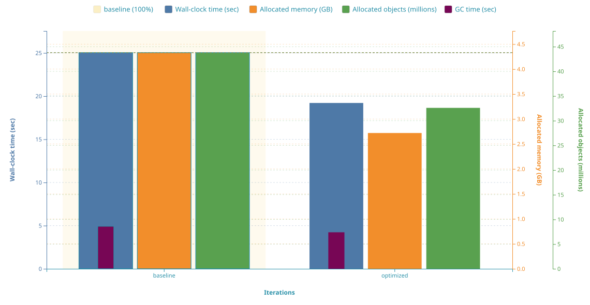
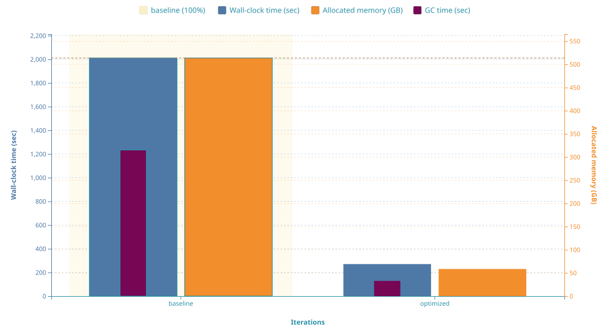
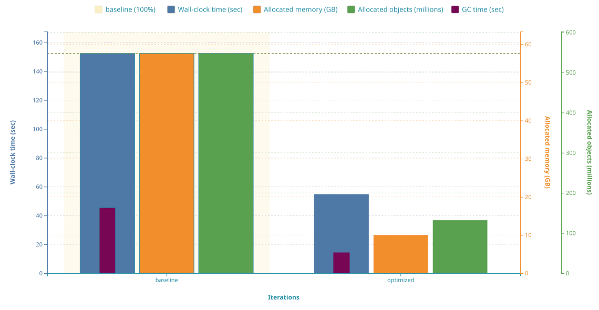

# AcuminatorTurbo

A personal performance playground for making [Acuminator](https://github.com/Acumatica/Acuminator) faster, leaner, and closer to ideal. Performance only. Here I try out my ideas as they come.

---

## Cumulative results

> **7.4× faster (−87%) · 8.8× less memory (−89%) · 9.6× less GC time (−90%)** on `PX.Objects` (large target).
> Cumulative since the start of measurements, across all iterations published in this fork.

| size | wall-clock | memory | objects | GC time |
| :--- | :---: | :---: | :---: | :---: |
| small (`PX.Objects.SV`) | 1.3× faster (−23%) | 1.6× less (−37%) | 1.3× less (−26%) | 1.2× less (−14%) |
| medium (`PX.Objects.AM`) | 2.8× faster (−64%) | 5.8× less (−83%) | 4.1× less (−76%) | 3.2× less (−68%) |
| large (`PX.Objects`) | **7.4× faster (−87%)** | **8.8× less (−89%)** | _n/a_ | **9.6× less (−90%)** |

| small (`PX.Objects.SV`) | medium (`PX.Objects.AM`) | large (`PX.Objects`) |
| :---: | :---: | :---: |
|  |  |  |

> ⚠ Approximate. The figures combine measurements taken at different historical baselines as iterations accumulated. See individual iteration cards below for exact frozen numbers per iteration.

---

## Iteration 1: Significant performance improvement

✅ Landed in upstream as [Acuminator#668](https://github.com/Acumatica/Acuminator/pull/668) on 2026-05-08.

Introduced `SymbolInfoCache` and eliminated double-binding of symbol info for member-access invocations in `NestedInvocationWalker`. The expression `foo.Bar()` was previously processed both as `MemberAccessExpressionSyntax` and `InvocationExpressionSyntax`, so every symbol lookup ran twice.

| small (`PX.Objects.SV`) | medium (`PX.Objects.AM`) | large (`PX.Objects`) |
| :---: | :---: | :---: |
|  time **1.3× faster (−23%)** · memory **1.6× less (−37%)** · objects **1.3× less (−26%)** · GC **1.2× less (−14%)** |  time **2.8× faster (−64%)** · memory **5.8× less (−83%)** · objects **4.1× less (−76%)** · GC **3.2× less (−68%)** |  time **7.4× faster (−87%)** · memory **8.8× less (−89%)** · GC **9.6× less (−90%)** |

> ⓘ Allocated object count could not be measured for the large target. Allocation sampling never completed there, even after hours of running. Small and medium charts include it.

**Commits:** [Acuminator#668](https://github.com/Acumatica/Acuminator/pull/668) (upstream merge).

---

## For upstream maintainers

The contents of `perf/` are fork-agnostic measurement infrastructure, free to cherry-pick or adapt. Any future iteration landed here may also be submitted upstream as a focused PR on request.
